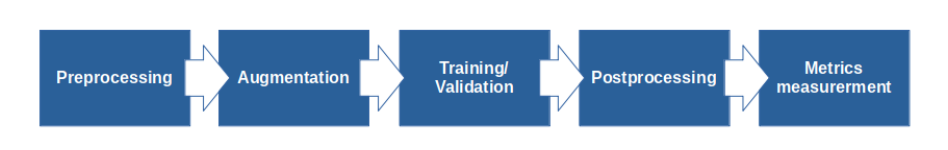

# Automatic segmentation of prostate in TRUS images using modified V-net convolutional neural network

This is the final fully commented version of the code used in my master thesis "Automatic prostate segmentation in transrectal ultrasound images using modified V-net convolutional neural network" [[Full text](https://opus.hs-furtwangen.de/frontdoor/index/index/start/0/rows/10/sortfield/score/sortorder/desc/searchtype/simple/query/segmentation+prostate/docId/7343)].
The repository contains all scripts for complete analysis, which are organized into 5 logical modules.



## Preprocessing (preprocessing.py, augment.py)
### Preprocessing
Often, the original medical images have very high resolution and might be heavy on system resources. To address this issue different preprocessing methods are utilized, such as cropping of the region of interest, rescaling, and normalization.

### Augmentation
Augmentation is an essential step when working with a limited sample size. The scripts include a collection of numpy and scipy functions, as well as a function for probabilistic augmentation used for hyperparameter optimization. This function generate augmented images on the fly during the hyperparameter optimization, while the frequency of each type of augmentation can be specified when calling the function.

## Hyperparameter optimization (hyper_param_optimization.py)

Training a robust model requires a lot of time. To reduce the time needed for a search for an optimal model, hyperparameter optimization was introduced. The hyperparameter optimization script is built upon Keras Tuner. A custom tuner has been implemented that search for the best augmentation methods and parameters, a dynamic V-net model (choosing between different loss functions and different model depth). A tuning example can be found in hyper_param_optimization.py.

## Training and testing (train_test.py)
By using a Data manager (data.py) the preprocessed data is read and piped into the fit function. During the training session, various metrics are measured and saved, namely loss, accuracy, and Sørensen–Dice. 

Testing uses a saved model to predict the prostate structure on preprocessed test images as a 3D binary mask. For preprocessing of the test images the same preprocessing steps and scripts are used.


## Post-processing (postprocessing.py)
The initial prediction might contain false positives, thus we introduced the postprocessing step. In this step, the images are analyzed layer by layer and on each layer, only the largest structure is saved. This significantly reduces the number of false positives and improves metrics as Hausdorf distance and Average surface distance.

## Metrics (metrics.py)
Measures Dice score, Jaccard score, Hausdorf, Average Surface Distance.

## Models
For the analysis, two types of models were used, based on the V-net model, a four-level and a five-level V-net neural network. Additionally, there is a dynamic model which has several hyperparameters and it is intended to be used for hyperparameter optimization.

### V-net (4 lvl) model


### V-net (5 lvl) model


## Requirements
```
python >= 3.8.3
pynrrd >= 0.4.2
numpy >= 1.18.5
scipy >= 1.5.0
matplotlib >= 3.2.2
tensorflow >= 2.2.0
elasticdeform >= 0.4.9
keras-tuner >= 1.0.1
medpy >= 0.4.0
scikit-image >= 0.16.2
```

# Quick start

It is important before training to move unprocessed NRRD images and binary masks to 'data/raw_train/image', 'data/raw_train/mask' or for testing 'data/raw_test/image', 'data/raw_test/mask'. Images and binary mask should have same name. 
*The placeholder text files in the folders should be removed before stating the analysis.

The workflow has been tested using a specific size of images. First, the region of interest was extracted from the image with size 512px * 512px * 64px. Then, the images were rescaled to 128px * 128px * 128px. The scripts work with a different resolution as well, but they should be modified accordingly beforehand.

### Examples:
#### Preprocessing (preprocessing.py)
`python preprocessing.py -dir="data/raw_train" -output="data/train"`

`python preprocessing.py -dir="data/raw_test" -output="data/test" -test_set`

*After preprocessing the data should be manually splitted in training and validation set.

#### Hyperparamter optimization (hyper_param_optimization.py)
`tune(image_size=(128,128,128), epochs=150, train_folder="data/train", val_folder="data/val")`

#### Train and test (train_test.py)
```python
train("the_best_model", (128,128,128), 150, hyper_par = {"factor":15,
                                                         "l_rate":0.0001,
                                                         "beta1":0.43649430628078034,
                                                         "beta2":0.5898459767675351,
                                                         "ams_grad":False,
                                                         "loss":"jaccard",
                                                         "fifth":True,
                                                         "rotate":0.533,
                                                         "deform":0.901,
                                                         "filters":0.370})
```

```python
test("the_best_model", (128,128,128),  test_folder="data/val", hyper_par = {"factor":15,
                                                                            "l_rate":0.0001,
                                                                            "beta1":0.43649430628078034,
                                                                            "beta2":0.5898459767675351,
                                                                            "ams_grad":False,
                                                                            "loss":"jaccard",
                                                                            "fifth":True,
                                                                            "rotate":0.533,
                                                                            "deform":0.901,
                                                                            "filters":0.370})
```

#### Postprocessing (postprocessing.py)

`python postprocessing.py -result="data/result" -out="data/postprocessed"`

#### Metrics (metrics.py)

`python metrics.py -result="data/result" -ref="data/test/mask" -csv="metrics.csv"`


